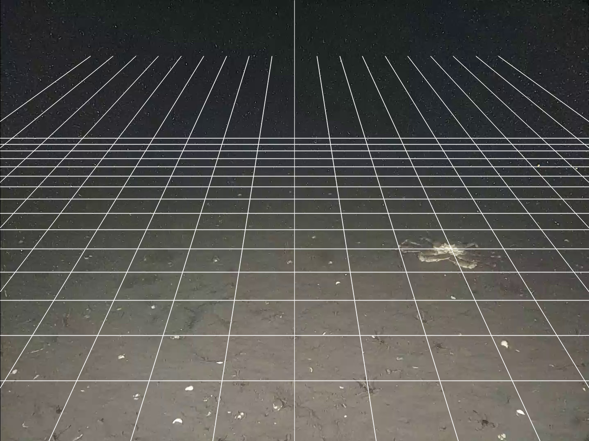

# calculate-perspective-grid
Calculate a perspective grid to estimate seafloor field of view covered by a camera

## Problem:
When using underwater cameras to study seafloor organisms it is often necessary to calculate the field of view (FOV) area 
recorded by the camera. This enables raw fauna counts to be standardized to densities (indiv. m<sup>-2</sup>) so they
can be compared across studies. Underwater cameras deployed for this purpose are often mounted at an oblique angle to 
the seafloor, which necessitates the consideration of perspective and illumination fields when calculating the FOV. 

## Solution:
Given a set of camera and mounting specifications (e.g., camera height, vertical and horizontal acceptance angles), a 
perspective grid can be calculated following [Wakefield & Genin (1987)](https://www.doi.org/10.1016/0198-0149(87)90148-8), 
which allows for the FOV area to be mathematically determined. I implemented this method in Python to overlay a perspective 
grid on a seabed image. An additional step to measure the FOV with acceptable illumination is currently being developed
using thresholding.

## To run:
1. Clone the project
```shell
git clone "https://github.com/rjcommand/calculate-perspective-grid.git"
```
2. Open a new terminal in the project directory


3. Run `main.py` from the terminal 
```shell
python3 main.py 'input_image.jpg' 'output_image_with_grid.png' -gr
```
- There are several arguments

    - `image_path` indicates the path to the seafloor image for which a perspective grid and FOV are desired
    - `output_image` indicates the path to where the output image should be saved
    - `-th` indicates the level of thresholding for identifying the area of acceptable illumination **(in development)**
    - `-gu` indicates whether the guide-lines should be shown on the image (e.g., diagonals denoting the focal point, etc.);
  defaults to `False`
    - `-gr` indicates whether the perspective grid lines should be shown on the image; defaults to `True`

Returns the original image with the perspective grid overlaid and the calculated field of view area in m<sup>2</sup>.

## Example output:
Test image is a screenshot taken from the Holyrood Subsea Observatory operated by Ocean Networks Canada (ONC) and the Fisheries 
and Marine Institute of Memorial University of Newfoundland and Labrador. Data available on ONC's [Oceans 3.0 online data
portal](https://data.oceannetworks.ca/DataSearch).


```shell
FOV area = 0.893 m^2
```